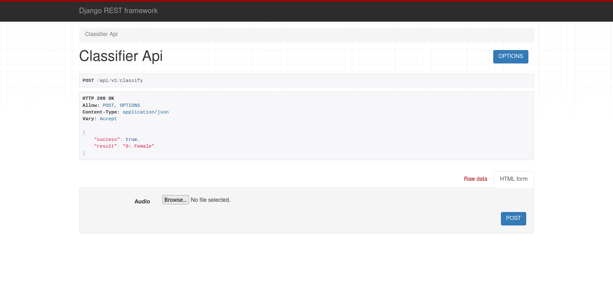

## Setup

### Clone and install packages
> 1. git clone https://github.com/cipher10111/gender-classification.git
> 2. cd gender-classification
> 3. for linux **python3 -m venv ./venv**
> 4. source venv/bin/activate
> 5. pip install -r requirements.txt 
> 6. source .env 
> 7. ./manage.py runserver

## Steps
1. Download audio files (http://www.repository.voxforge1.org/downloads/SpeechCorpus/Trunk/Audio/Main/16kHz_16bit)
2. Extract features from the audio files and save features.csv
3. Data visualization
4. Train the model and parameter tuning
5. predict output

## Demo

<a href="https://drive.google.com/file/d/1gERWpauTWfyYm9VEl3OqoNNN6u1ZtCfd/view?usp=sharing">
  

    
  

</a>